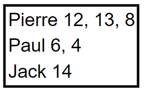
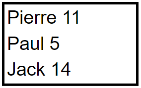

# LSIN610EC

## Session 1

> **Question 1** 
>
> Qu'est qu'une grammaire **ambigüe** ?

> **Question 2** 
>
> Calculer **PREMIER** pour les **terminaux** et les **non-terminaux** de la grammaire suivante :
>
> **S ➔ aS | bX**
>
> **X ➔ Xc | d**

> **Question 3** 
>
> Calculer **SUIVANT** pour les **non-terminaux** de la grammaire ci-dessus

> **Question 4**
>
> Comment décider si une grammaire est **LL(1)** ?

> **Question 5**
>
> Comment construire une table d'analyse pour une grammaire **LL(2)** ?

> **Question 6**
>
> Comment en **Lex/Flex** fait-on pour distinguer un **mot clé** (par exemple while) d'un **identifiant** dans un langage ?

> **Question 7**
>
> A quoi sert le **%left** devant un token en **Yacc/Bison**

> **Question 8**
>
> Comment définit-on les différents types utilisés en **Yacc/Bison** pour les **terminaux** ?

> **Question 9**
>
> Comment définit-on les différents types utilisés en **Yacc/Bison** pour les **non-terminaux** ?

> **Question 10**
>
> Quelle est l'utilité de typer les **terminaux** et les **non-terminaux** en **Yacc/Bison**

> **Question 11**
>
> ***Liste de note*** :
> Mini langage qui prend en entrée des lignes constituées d'un **prénom** suivi de **notes** séparées par des virgules
>
> 
>
> En sortie, on devra avoir la **moyenne général** pour chaque personne des notes :
>
> 
>
> Pour simplifier, on suppose que les notes sont des **entiers non signées**. Une moyenne est une moyenne **entière**.
>
> Vous devez donner la **grammaire**, le fichier **Lex** et **Bison**
